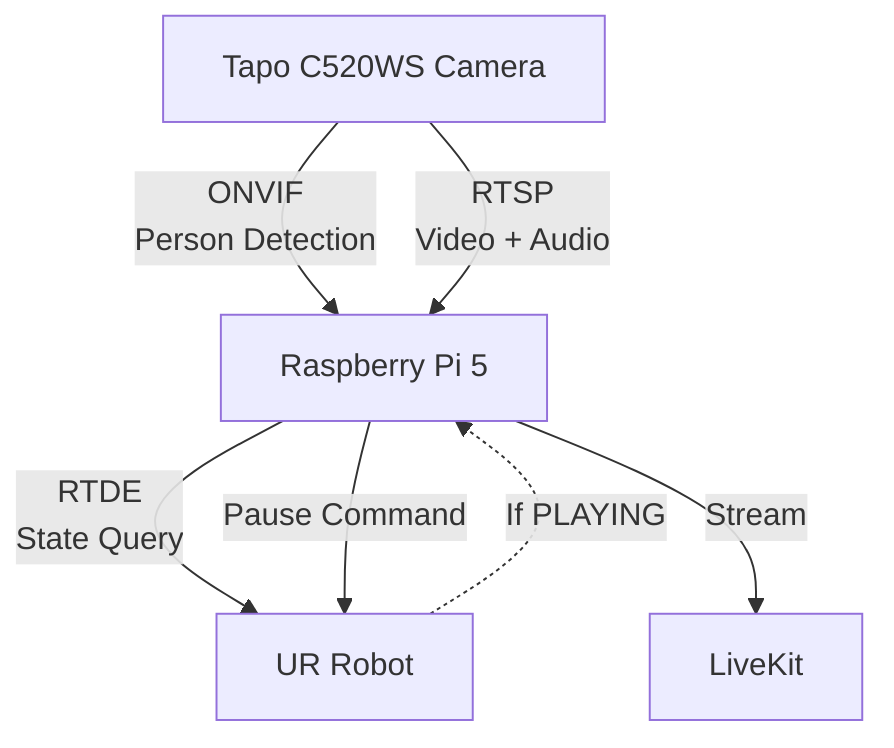

# Cam Guard - UR Robot Security System

## Description

Automated security system that integrates a Tapo C520WS camera with a UR robot. When the camera detects a person, the system automatically pauses the UR robot if it's running.

## Functionality

1. **Person Detection**: The Tapo C520WS camera detects people using ONVIF (`IsPeople=true`)
2. **State Query**: The Raspberry Pi 5 queries the UR robot's `RuntimeState` via RTDE
3. **Automatic Control**: If the robot is in `PLAYING` state, a pause command is sent (`PAUSING/PAUSED`)
4. **Continuous Streaming**: The Pi maintains a single RTSP connection with the camera to send video+audio to LiveKit

## Diagram

## Libraries Used

### UR RTDE

- **URL**: https://pypi.org/project/ur-rtde/
- **Installation**: `pip install ur-rtde`

### Python ONVIF Zeep

- **URL**: https://github.com/FalkTannhaeuser/python-onvif-zeep
- **Installation**: `pip install onvif-zeep`
